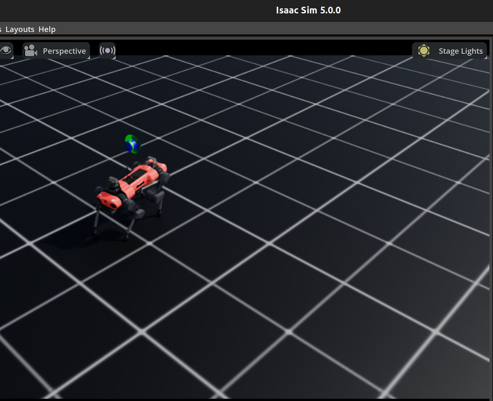
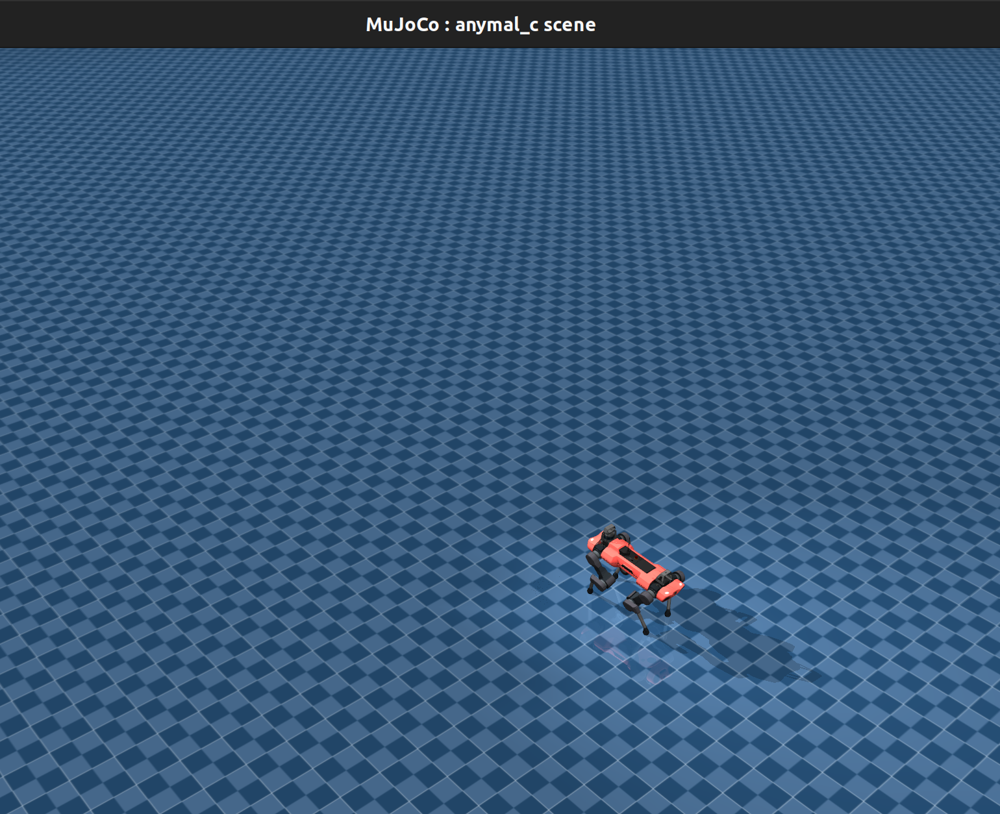

# Sim-to-Sim Transfer: Isaac Lab to MuJoCo

> **Note:** This repository contains experimental research code. The implementations are under active development and may contain bugs or incomplete features. Use at your own discretion for research and educational purposes.

## Overview

This project develops a transfer learning pipeline for training low-level locomotion controllers in **NVIDIA Isaac Lab** and deploying them in **MuJoCo**. The primary goal is to validate that policies trained in a highly parallelized simulator (Isaac Lab) can be successfully transferred to a different physics engine (MuJoCo).

The current focus is on legged locomotion for the **ANYmal-C** quadruped robot.

<p align="center">
  
  
  <br/>
  <em>Left:</em> ANYmal-C policy training in Isaac Lab &nbsp;&nbsp;|&nbsp;&nbsp; <em>Right:</em> Deployed walking in MuJoCo
</p>

## Project Structure

```
ReinforcementLearning/
├── train_flat_policy.sh                # Bash script to automate training and export
├── test_anymal_policy_in_mujoco.py     # Main script to deploy Isaac Lab policies in MuJoCo
├── replay_single_robot.py              # Script to replay policy in Isaac Lab and log data
└── Sim2SimTransferProject/             # Analysis and comparison tools
    ├── collected-data/                 # CSV logs from both simulators
    ├── compare_simulators.py           # Script to generate comparison plots
    ├── sim2sim_data_visualization.ipynb # Interactive notebook for data analysis
    └── images-and-plots/               # Generated plots and visuals
```

## Workflow

### 1. Training in Isaac Lab

Use the provided shell script to train a flat-terrain locomotion policy using RSL-RL in Isaac Lab. This script handles training and automatically exports the policy to TorchScript (`.pt`) and ONNX formats.

> **Note:** You must have IsaacLab already installed on your machine.

```bash
./train_flat_policy.sh
```

**Key Configuration:**
- **Task:** `Isaac-Velocity-Flat-Anymal-C-v0`
- **Algorithm:** PPO (via RSL-RL)
- **Observation Space:** 48D (Base linear/angular vel, Projected gravity, Commands, Joint pos/vel, History)
- **Control Frequency:** 50 Hz (Simulation: 200 Hz, Decimation: 4)

### 2. Data Collection in Isaac Lab

To validate the policy's behavior in the source domain, use `replay_single_robot.py`. This script runs the policy on a single robot instance and logs state data to a CSV file.

**Setup:**
You must copy this script to your Isaac Lab installation:
```bash
cp replay_single_robot.py /path/to/IsaacLab/scripts/reinforcement_learning/rsl_rl/
```

**Usage:**
Run from the Isaac Lab root directory:
```bash
./isaaclab.sh -p scripts/reinforcement_learning/rsl_rl/replay_single_robot.py \
    --task Isaac-Velocity-Flat-Anymal-C-Play-v0 \
    --num_envs 1 \
    --load_run <RUN_FOLDER_NAME> \
    --checkpoint "model_*.pt"
```

### 3. Deployment in MuJoCo

The `test_anymal_policy_in_mujoco.py` script loads the exported TorchScript policy and runs it in the MuJoCo physics simulator. It handles all necessary domain adaptations (joint reordering, actuator mapping, frame transforms).

```bash
# Ensure you have the required dependencies (mujoco, torch, scipy)
python test_anymal_policy_in_mujoco.py
```

**Features:**
- Loads the trained `.pt` policy.
- Maps Isaac Lab observations to MuJoCo state.
- Handles mismatched joint orders between simulators.
- Logs simulation data to CSV for comparison.

### 4. Sim-to-Sim Comparison

Use the tools in `Sim2SimTransferProject` to analyze the differences between the two simulators.

- **`compare_simulators.py`**: Reads CSV logs from both simulators and generates plots comparing joint positions, velocities, base state, and contact forces.
- **`sim2sim_data_visualization.ipynb`**: Jupyter notebook for interactive exploration of the data.

## Technical Implementation Details

Transferring a policy between simulators requires addressing several fundamental mismatches:

### 1. Joint Ordering Mismatch
- **Isaac Lab:** Groups joints by type (HAA, HFE, KFE).
- **MuJoCo:** Groups joints by leg (LF, RF, LH, RH).
- **Solution:** Bidirectional index mapping arrays convert state and actions on-the-fly.

### 2. Actuator Interface
- **Challenge:** Isaac Lab policies output PD target positions, while MuJoCo's actuators can be configured differently.
- **Solution:** We use MuJoCo position actuators with gains matching the training config. Critical initialization ensures `ctrl` inputs match `qpos` at start to prevent instabilities.

### 3. Coordinate Systems
- **Challenge:** Quaternion conventions and frame definitions may vary.
- **Solution:** Explicit conversion (e.g., `[w, x, y, z]` vs `[x, y, z, w]`) and rotation matrix transformations ensure the policy receives observations in the expected body frame.

## Requirements

- **Isaac Lab Environment:**
  - NVIDIA Isaac Sim 4.5+
  - Isaac Lab framework
  - RSL-RL library

- **MuJoCo Environment:**
  - MuJoCo 3.x
  - `mujoco` python package
  - `torch`
  - `scipy` (for rotation transforms)
  - `matplotlib`, `pandas` (for analysis)

## License

This code follows the licensing of the Isaac Lab framework and MuJoCo Menagerie assets.
