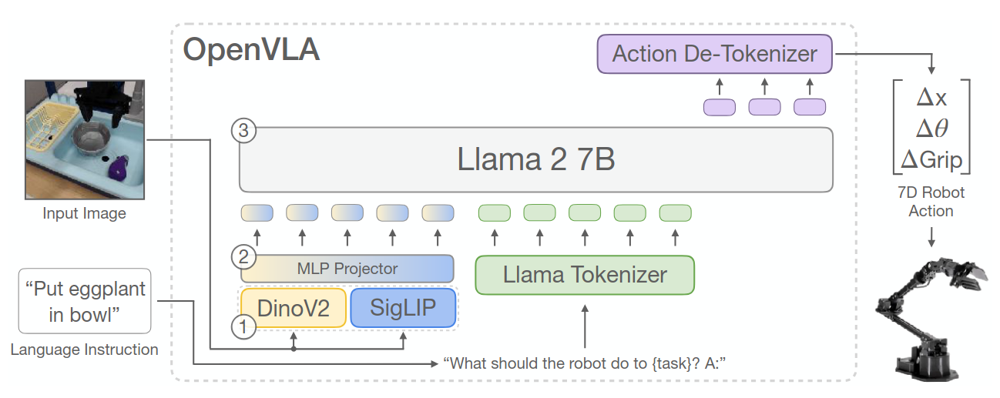
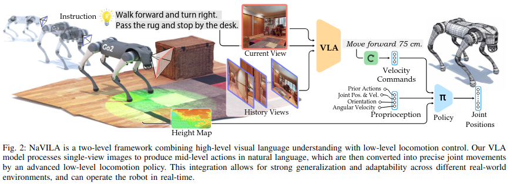

# Bridging Language and Action: How Vision-Language-Action Models and Reinforcement Learning Enable Intelligent Robotic Decision Making

**Author:** Lorin Achey 

**Date:** October 15, 2025

---

AI Use Statement: Claude-4.5-Sonnet was used to polish language, build formulas with Latex, and reformat content into markdown for better presentation.

## Table of Contents

TODO: Make sure sections actually link

1. [Introduction](#1-introduction)
2. [Foundations of Sequential Decision Making](#2-foundations-of-sequential-decision-making)
   - 2.1 [Markov Decision Processes](#21-markov-decision-processes)
   - 2.2 [The Reinforcement Learning Paradigm](#22-the-reinforcement-learning-paradigm)
3. [Vision-Language-Action Models: A New Paradigm](#3-vision-language-action-models-a-new-paradigm)
   - 3.1 [Architecture and Design](#31-architecture-and-design)
   - 3.2 [From Language to Grounded Actions](#32-from-language-to-grounded-actions)
4. [Where RL Meets VLA](#4-rl-meets-vla)
   - 4.1 [RL Fine-Tuning of VLA Models](#41-rl-fine-tuning-of-vla-models)
   - 4.2 [Hierarchical Architectures](#42-hierarchical-architectures)
5. [Mathematical Framework for VLA-RL Integration](#5-mathematical-framework-for-vla-rl-integration)
6. [Applications and Future Directions](#6-applications-and-future-directions)
7. [Conclusion](#7-conclusion)
8. [References](#8-references)

---

## 1. Introduction

The intersection of natural language understanding and robotic control is an exciting, active area of research in robotics. Advances in Large Language Models (LLMs) and Vision-Language Models (VLMs) paved the way for Vision-Language-Action (VLA) models which are systems capable of translating high-level human instructions into executable robot behaviors. At the same time, Reinforcement Learning (RL) remains the dominant framework for solving sequential decision-making problems in robotics. The convergence of these two approaches offers a promising path toward building general-purpose robotic systems that can understand human intent, reason about their environment, and adapt to novel situations.

When I first learned about VLAs, I imagined them as a substitute for traditional Reinforcement Learning. Consider a simple navigation task: moving a robot through a grid world to reach a goal state. In a classical RL setup, the robot would explore through trial and error, eventually learning an optimal policy from reward feedback. In contrast, I pictured a VLA-based system where I could simply instruct the robot, “Go to the green circle,” and it would infer the necessary sequence of actions from visual input. This framing makes RL and VLAs seem fundamentally distinct.

However, recent research suggests otherwise. RL and VLAs are used in combination in many ways, from the use of RL during pre-training and supervised fine-tuning to hierarchical control stacks in autonomous navigation. What began as a comparison between two seemingly distinct paradigms became an exploration of their interconnected use cases. In this post, we’ll examine how RL and VLA models complement each other in addressing core challenges in robotics, focusing on the theoretical foundations and practical integration strategies that enable robots to combine semantic understanding with low-level adaptive control.

## 2. Foundations

Before diving into how Reinforcement Learning (RL) and Vision-Language-Action (VLA) models intersect, let's briefly review their conceptual foundations.

### 2.1 Reinforcement Learning

Reinforcement Learning is a framework for sequential decision-making under uncertainty. We'll consider the fully observable case here, but in practice, robots often face partial observability, where parts of the environment are hidden or noisy.

An RL agent interacts with an environment commonly modeled an Markov Decision Process (MDP), formalized as a tuple $\mathcal{M} = (\mathcal{S}, \mathcal{A}, P, R, \gamma)$ where:

- $\mathcal{S}$ is the state space representing possible robot and environment configurations
- $\mathcal{A}$ is the action space containing available robot actions
- $P: \mathcal{S} \times \mathcal{A} \times \mathcal{S} \to [0,1]$ is the transition probability function
- $R: \mathcal{S} \times \mathcal{A} \to \mathbb{R}$ is the reward function
- $\gamma \in [0,1)$ is the discount factor

The Markov property ensures that the future state depends only on the current state and action:

$$P(s_{t+1} | s_t, a_t, s_{t-1}, a_{t-1}, \ldots) = P(s_{t+1} | s_t, a_t)$$

At each timestep (t), the agent observes a state $(s_t)$, takes an action $(a_t)$, receives a reward $(r_t)$, and transitions to a new state $(s_{t+1})$. The goal is to learn a policy $(\pi(a|s))$ that maximizes the expected cumulative reward $(E[\sum_t \gamma^t r_t])$.

Reinforcement learning seeks to find an optimal policy $\pi^*: \mathcal{S} \to \mathcal{A}$ that maximizes the expected cumulative discounted reward:

$$\pi^* = \arg\max_{\pi} \mathbb{E}_{\tau \sim \pi} \left[ \sum_{t=0}^{\infty} \gamma^t R(s_t, a_t) \right]$$

where $\tau = (s_0, a_0, s_1, a_1, \ldots)$ denotes a trajectory.

The state-action value function (Q-function) quantifies the expected return from taking action $a$ in state $s$ and following policy $\pi$ thereafter:

$$Q^\pi(s, a) = \mathbb{E}_{\tau \sim \pi} \left[ \sum_{k=0}^{\infty} \gamma^k R(s_{t+k}, a_{t+k}) \mid s_t = s, a_t = a \right]$$

The optimal Q-function satisfies the Bellman optimality equation:

$$Q^*(s, a) = \mathbb{E}_{s' \sim P(\cdot \mid s,a)} \left[ R(s, a) + \gamma \max_{a'} Q^*(s', a') \right]$$

Modern RL algorithms like Soft Actor-Critic (SAC) [1], Proximal Policy Optimization (PPO) [2], and TD3 [3] leverage neural network function approximators to handle high-dimensional state and/or action spaces. RL has been heavily used for robotic control because it explicitly optimizes behavior through interaction. However, it can suffer from sample inefficiency, reward engineering challenges, and limited generalization to novel tasks or domains.

### 2.2 Vision-Language-Action Models

Vision-Language-Action (VLA) models emerge from the foundation model paradigm. These systems combine large-scale pretraining on multimodal datasets (images, text, and sometimes video or actions) to learn joint representations that connect visual perception, linguistic understanding, and physical interaction. These models leverage internet-scale data leading to pretrained models that have exposure to much more diverse data than a typical robotics dataset.

* **Vision encoders** (e.g., ViTs, CNNs) map images or visual observations into latent embeddings.
* **Language encoders/decoders** (e.g., Transformers, LLMs) process textual inputs or instructions.
* **Action modules** map internal representations into motor commands, joint torques, or discrete control primitives.

In a VLA, these components are often connected through a shared embedding space or a transformer-based architecture that fuses multimodal information. This enables the system to interpret instructions such as *"Pick up the red cube and place it on the blue block"* and produce a coherent sequence of actions. There are many different action token representations, but for the sake of this post just envision directly outputting continuous robotics controls. For an example, see Figure 1 which shows how image and text are input into the VLA which then outputs a vector of robot controls for a gripper.

  
  
<em>Figure 1: OpenVLA architecture showing the integration of vision encoders, language models, and action prediction modules. Diagram from Liu et al. [8], representing the OpenVLA model [9].</em>

### 2.3 Conceptual Contrast

| Aspect              | Reinforcement Learning                         | Vision-Language(-Action) Models                                |
| :------------------ | :--------------------------------------------- | :------------------------------------------------------------- |
| **Core Objective**  | Maximize cumulative reward via interaction     | Learn multimodal representations and semantic grounding        |
| **Learning Signal** | Scalar rewards from environment                | Supervised or self-supervised cross-modal alignment            |
| **Data Source**     | Experience (simulated or real)                 | Large curated datasets (image–text–action triples)             |
| **Strengths**       | Adaptive control, exploration, online learning | Generalization, compositional reasoning, instruction following |
| **Limitations**     | Sample inefficiency, narrow task focus         | Lack of grounding without interaction, weak low-level control  |

### 2.4 Toward Integration

While these paradigms originated separately, the line between them is increasingly blurred. RL provides the mechanism for **adaptive control and feedback-driven learning**, while VLAs supply **semantic priors** and **contextual understanding**. It's hypothesized that integrating the two enables robots to act optimally but also understand what they are doing and why.

In the next section, we'll explore how these methods are being combined in practice from using RL to fine-tune pretrained VLA models, to employing VLAs as high-level planners in hierarchical robotic systems.

## 4. Where RL Meets VLA

The combination of Reinforcement Learning with Vision-Language-Action models is still an active area of research, but several promising strategies have emerged. In this section, we'll explore two main approaches: fine-tuning VLAs with RL and using hierarchical architectures that combine both methods.

### 4.1 RL Fine-Tuning of VLA Models

VLA models are great at generalizing to new situations, but they can fall short when tasks demand high precision think contact-rich manipulation like inserting a peg into a hole, or tasks where exact positioning matters. This is where RL fine-tuning comes in, allowing us to directly optimize the VLA policy using task-specific rewards.

Several recent papers have shown different ways to fine-tune VLAs with RL:

**VLA-R1 [4]** integrates Reinforcement Learning from Verifiable Rewards (RLVR) with Group Relative Policy Optimization (GRPO) in an effort to provide VLAs with chain-of-thought style reasoning capabilities seen in recent LLMs. This approach helps VLA models better reason about object affordances and generate action sequences that are physically plausible not just semantically correct.

**iRe-VLA [5]** tackles one of the practical challenges: direct RL fine-tuning can be computationally expensive and unstable. Their solution is an iterative framework that alternates between RL updates and supervised learning, getting the benefits of both approaches.

The main challenge here is a balancing act: you want to improve performance on specific tasks without losing the broad generalization that makes VLAs useful in the first place. Techniques like regularization (keeping the policy close to the pretrained one) or multi-task RL help maintain this balance.

### 4.2 Hierarchical Architectures

Another powerful strategy uses hierarchical architectures where VLA models and RL work at different levels of abstraction.

One approach is to separate high-level planning and low-level control:

- **High-level (VLA)**: Interprets language instructions and outputs subgoals or high-level action choices
- **Low-level (RL)**: Executes those high-level commands and handles the nitty-gritty details of motor/actuator/joint control

This division of labor has a practical advantage: the VLA can run at a slower rate while the RL controller runs fast. This matters because current VLAs are still slower than traditional low-level controllers. You don't want your robot waiting around for the VLA because it could cause instability in the controls.

**NaVILA [6]** is a great example of this approach in action (pun intended). The VLA gets fine-tuned to output "mid-level actions" (e.g. move forward 75 centimeters) which then feed into a PPO-trained RL policy. The RL policy takes those mid-level commands and figures out the specific joint movements needed to execute them. The researchers demonstrated this on real legged robots navigating different environments based on language commands. See the diagram below that shows the NaVILA system [6].

  
  
<em>Figure 2: NaVILA hierarchical architecture. The VLA generates mid-level actions that are executed by a low-level RL policy trained with PPO. From Cheng et al. [6].</em>

**IRL-VLA [7]** applies a similar hierarchical idea to autonomous driving, using a three-stage approach:
1. Pretrain a VLA policy through imitation learning
2. Build a reward world model using inverse RL
3. Use that reward model to guide further RL training (with PPO)

The innovation proposed in this paper is that the reward model lets you train VLA agents with reinforcement learning without having to rely on a simulator.

## 6. Applications and Future Directions

The integration of VLA models and RL has enabled capabilities in several robotics domains (i.e. navigation, manipulation). VLA models can give robots the language and perception to understand our goals, while RL can give them the experience and feedback to achieve those goals effectively. As these two approaches continue to merge, we move closer to robots that can learn new tasks from natural instructions and improve through experience, just like humans do.

**Questions to ponder (potential future research directions)**:

1. Can we use VLAs to design methods that let RL fine-tune robot behavior with fewer real-world trials and less data?

2. Can a robot trained in simulation use the semantic understanding from a VLA to adapt more smoothly to the real world?

3. What would it take for a robot to know when it's unsure about its perception or decision, and explore safely as a result? Can a combination of VLAs and RL lead to verifiably safer systems?

4. Could natural language become a way for people to give feedback and guide a robot's learning process in real time? How would this combination of natural language through human-feedback differ from a typical Reinforcement Learning through Human Feedback paradigm (RLHF)?

## 7. Conclusion

Integrating Vision-Language-Action models and Reinforcement Learning is promising for robotic sequential decision making. VLA models provide semantic understanding, broad generalization, and efficient learning from diverse offline data. RL contributes adaptive optimization, fine grained control, and the ability to discover novel behaviors through environmental interaction.

By carefully integrating these approaches whether through direct RL fine-tuning or hierarchical architectures, we can build robotic systems that combine the semantic richness of large-scale pre-training with the adaptability and optimality of reinforcement learning. As these methods mature and scale, we move closer to more capable robots that can understand natural language instructions, reason about their environment through visual perception, and continuously improve their capabilities through experience.

## 8. References

**NOTE:** Whenever possible, this post references peer-reviewed literature from the robotics domain. However, some of the most recent works are still in review and thus have not been through the peer-review process yet. These cited works are preprint editions and their Arxiv links are provided.

1. Haarnoja, T., Zhou, A., Abbeel, P., & Levine, S. (2018). Soft Actor-Critic: Off-Policy Maximum Entropy Deep Reinforcement Learning with a Stochastic Actor. *ICML 2018*. [arXiv:1801.01290](https://arxiv.org/abs/1801.01290)

2. Schulman, J., Wolski, F., Dhariwal, P., Radford, A., & Klimov, O. (2017). Proximal Policy Optimization Algorithms. *arXiv preprint*. [arXiv:1707.06347](https://arxiv.org/abs/1707.06347)

3. Fujimoto, S., van Hoof, H., & Meger, D. (2018). Addressing Function Approximation Error in Actor-Critic Methods. *ICML 2018*. [arXiv:1802.09477](https://arxiv.org/abs/1802.09477)

4. Ye, A., Zhang, Z., Wang, B., et al. (2025). VLA-R1: Enhancing Reasoning in Vision-Language-Action Models. *arXiv preprint*. [arXiv:2510.01623](https://arxiv.org/abs/2510.01623)

5. Chen, Y., et al. (2024). Improving Vision-Language-Action Model with Online Reinforcement Learning (iRe-VLA). *ICRA 2025*. [IEEE Paper 11127299](https://ieeexplore.ieee.org/stamp/stamp.jsp?tp=&arnumber=11127299)

6. Cheng, A., et al. (2025). NaVILA: Legged Robot Vision-Language-Action Model for Navigation. *Robotics: Science and Systems 2025*. [RSS Paper](https://www.roboticsproceedings.org/rss21/p018.pdf)

7. Jiang, A., Gao, Y., Wang, Y., et al. (2025). IRL-VLA: Training a Vision-Language-Action Policy via Reward World Model. *arXiv preprint*. [arXiv:2508.06571](https://arxiv.org/abs/2508.06571)

8. Liu, J., Gao, F., Wei, B., Chen, X., Liao, Q., Wu, Y., Yu, C., & Wang, Y. (2025). What Can RL Bring to VLA Generalization? An Empirical Study. *arXiv preprint*. [arXiv:2505.19789](https://arxiv.org/abs/2505.19789)

9. Kim, M. J., Pertsch, K., Karamcheti, S., Xiao, T., Balakrishna, A., Nair, S., Rafailov, R., Foster, E., Lam, G., Sanketi, P., et al. (2024). OpenVLA: An Open-Source Vision-Language-Action Model. *arXiv preprint*. [arXiv:2406.09246](https://arxiv.org/abs/2406.09246)

